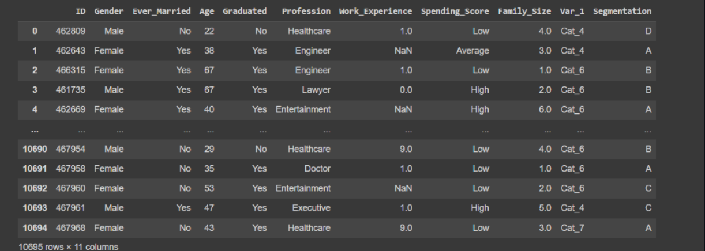
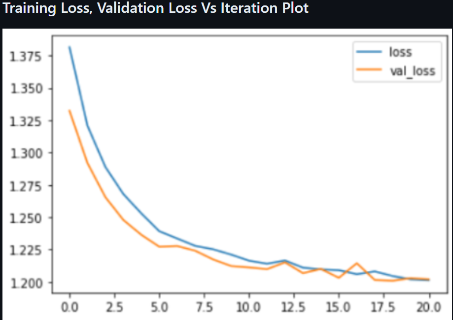
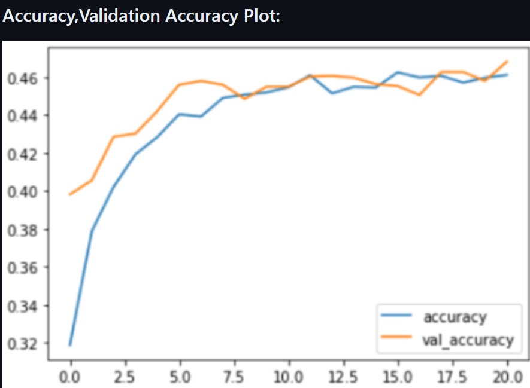
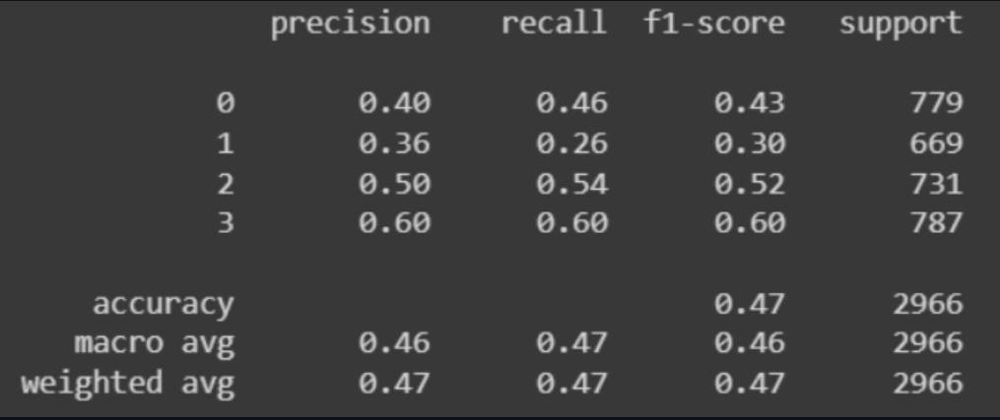
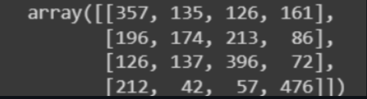
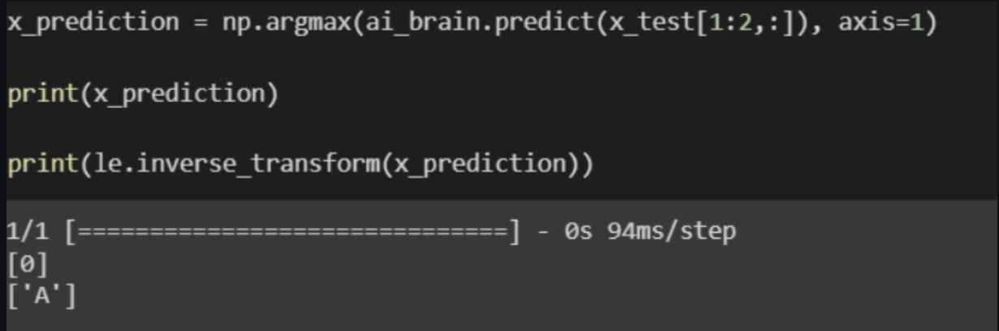

# Developing a Neural Network Classification Model

## AIM

To develop a neural network classification model for the given dataset.

## Problem Statement

An automobile company has plans to enter new markets with their existing products. After intensive market research, they’ve decided that the behavior of the new market is similar to their existing market.

In their existing market, the sales team has classified all customers into 4 segments (A, B, C, D ). Then, they performed segmented outreach and communication for a different segment of customers. This strategy has work exceptionally well for them. They plan to use the same strategy for the new markets.

You are required to help the manager to predict the right group of the new customers.

## Neural Network Model

Include the neural network model diagram.

## DESIGN STEPS
STEP 1:
Import the necessary packages & modules.

STEP 2:
Load and read the dataset.

STEP 3:
Perform pre processing and clean the dataset

STEP 4:
Encode categorical value into numerical values using ordinal/label/one hot encoding.

STEP 5:
Visualize the data using different plots in seaborn.

STEP 6:
Normalize the values and split the values for x and y.

STEP 7:
Build the deep learning model with appropriate layers and depth.

STEP 8:
Analyze the model using different metrics.

STEP 9:
Plot a graph for Training Loss, Validation Loss Vs Iteration & for Accuracy, Validation Accuracy vs Iteration.

STEP 10:
Save the model using pickle.

STEP 11:
Using the DL model predict for some random inputs.

## PROGRAM
Name: P.Sarveshvaran
Reg.no: 212221230090
~~~
import pandas as pd
import numpy as np
import matplotlib.pyplot as plt
import seaborn as sns
from sklearn.metrics import classification_report as report
from sklearn.metrics import accuracy_score as acc
from sklearn.metrics import confusion_matrix as conf

df = pd.read_csv("/content/customers (1).csv")
df

from sklearn.preprocessing import MinMaxScaler
from sklearn.preprocessing import LabelEncoder
from sklearn.preprocessing import OneHotEncoder
from sklearn.preprocessing import OrdinalEncoder

categories_list=[['Male', 'Female'],
                 ['No', 'Yes'],
                 ['No', 'Yes'],
                 ['Healthcare', 'Engineer', 'Lawyer', 'Artist', 'Doctor',
                  'Homemaker', 'Entertainment', 'Marketing', 'Executive'],
                 ['Low', 'Average', 'High']]

enc = OrdinalEncoder(categories=categories_list)

df1 = df_cleaned.copy()

df1[['Gender','Ever_Married',
     'Graduated','Profession',
     'Spending_Score']] = enc.fit_transform(df1[['Gender','Ever_Married',
                                                  'Graduated','Profession',
                                                  'Spending_Score']])
df1

le = LabelEncoder()
df1['Segmentation'] = le.fit_transform(df1['Segmentation'])
ohe = OneHotEncoder()
ohe.fit(y1)
y1.shape
y = ohe.transform(y1).toarray()
y.shape

from sklearn.model_selection import train_test_split
x_train,x_test,y_train,y_test = train_test_split(x,y,test_size=1/3,random_state=50)

import tensorflow as tf
from tensorflow.keras.models import Sequential
from tensorflow.keras.models import load_model
from tensorflow.keras.layers import Dense
from tensorflow.keras.layers import Dropout
from tensorflow.keras.layers import BatchNormalization
from tensorflow.keras.callbacks import EarlyStopping

ai = Sequential([Dense(80,input_shape = [8]),
                 Dense(64,activation="relu"),
                 Dense(46,activation="relu"),
                 Dense(21,activation="relu"),
                 Dense(4,activation="softmax")])

ai.compile(optimizer='adam',
           loss='categorical_crossentropy',
           metrics=['accuracy'])
           
early_stop = EarlyStopping(monitor='val_loss',mode='max', patience=10)

ai.fit(x = x_train, y = y_train,
             epochs=2000, batch_size=256,
             validation_data=(x_test,y_test),
            callbacks=[early_stop]
             )
            
metrics = pd.DataFrame(ai.history.history)
metrics.head()
metrics[['loss','val_loss']].plot()
metrics[['accuracy','val_accuracy']].plot()

print(report(y_truevalue,x_pred))

import pickle

ai.save('customer_classification_model.h5')
     

with open('customer_data.pickle', 'wb') as fh:
   pickle.dump([x_train,y_train,x_test,y_test,df1,df_cleaned,scale,enc,ohe,le], fh)
     

ai_brain = load_model('customer_classification_model.h5')
     

with open('customer_data.pickle', 'rb') as fh:
   [x_train,y_train,x_test,y_test,df1,df_cleaned,scale,enc,ohe,le]=pickle.load(fh)

x_prediction = np.argmax(ai_brain.predict(x_test[1:2,:]), axis=1)

print(x_prediction)

print(le.inverse_transform(x_prediction))
~~~

## Dataset Information

## OUTPUT
### Training Loss, Validation Loss Vs Iteration Plot

### Classification Report

### Confusion Matrix

### New Sample Data Prediction

## RESULT
A neural network classification model is developed for the given dataset.
